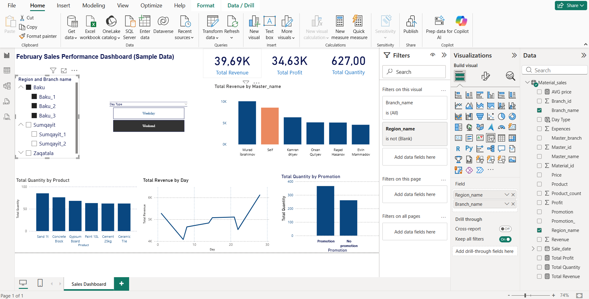

# February Sales Performance Dashboard
This Power BI dashboard analyzes February sales performance for a construction materials company using sample data.
## Project Overview
This project focuses on analyzing sales performance, revenue, profitability, and sales channels using Power BI.
## Business Context
The company operates in the construction materials sector with multiple branches and sales channels.
## Data Sources & Data Model
The dashboard is built using multiple related tables including Sales, Materials, Branches, and Masters.
## Key Analyses & Insights
- Overall KPIs
- Product performance
- Sales trends
- Sales channels comparison
- Promotion analysis
## Dashboard Preview

## Tools & Skills Used
- Power BI Desktop
- Data Modeling
- DAX
- Data Visualization
- ## Conclusion
This dashboard demonstrates how a Junior Data Analyst can turn raw data into actionable insights.
## Project Files
- February_Sales Performance Dashboard.pbix
- images/

